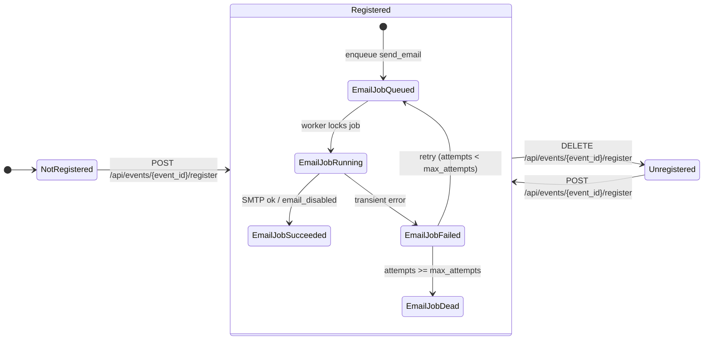
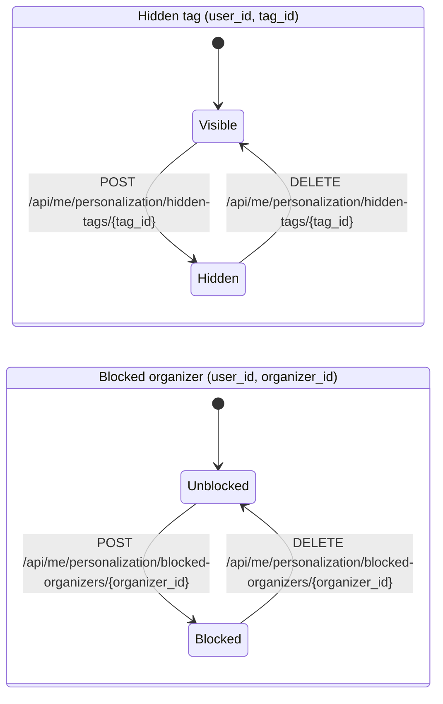

# Mermaid UML diagrams

This document contains high-level Mermaid UML diagrams for EventLink (backend domain + core flows).

## Backend domain (SQLAlchemy models)

## State machines

### Registration + confirmation email job

### Personalization controls (hidden tags + blocked organizers)

