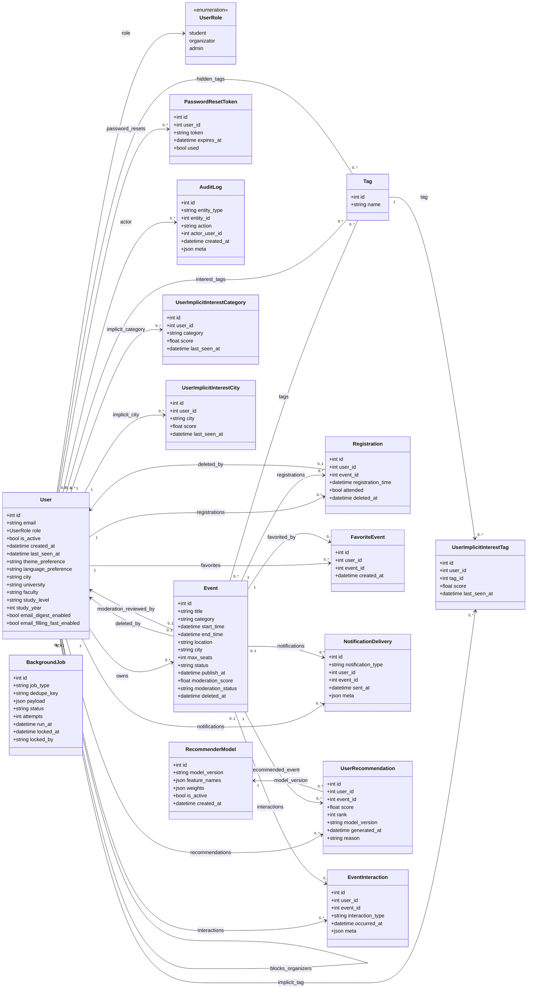

# Mermaid UML diagrams

This document contains high-level Mermaid UML diagrams for EventLink (backend domain + core flows).

## Backend domain (SQLAlchemy models)



## Communication diagram (core components + key messages)

```mermaid
flowchart LR
  Student([Student])
  Organizer([Organizer])
  Admin([Admin])

  UI[UI (React/Vite)]
  API[Backend API (FastAPI)]
  DB[(Postgres)]
  Worker[Worker (task queue)]
  SMTP[(SMTP provider)]

  Student -->|1. Browse / register / personalize| UI
  Organizer -->|2. Create events / manage participants| UI
  Admin -->|3. Moderate + manage users| UI

  UI -->|4. REST calls (JWT)| API
  API -->|5. Query / write| DB
  API -->|6. Enqueue BackgroundJob (send_email, digests, alerts)| DB

  Worker -->|7. Poll + lock queued jobs| DB
  Worker -->|8. Deliver outbound email| SMTP
  Worker -->|9. Persist delivery result| DB
```

## Interaction overview diagram (student discovery + registration + personalization)

```mermaid
flowchart TB
  Start([Start]) --> Browse[Browse events list]
  Browse --> Open[Open event details]

  Open --> Decide{Choose action}

  Decide -->|Hide tag| HideTag[POST /api/me/personalization/hidden-tags/{tag_id}]
  Decide -->|Block organizer| BlockOrg[POST /api/me/personalization/blocked-organizers/{organizer_id}]
  HideTag --> Refresh[Reload events list (filters applied)]
  BlockOrg --> Refresh

  Decide -->|Register| Register[POST /api/events/{event_id}/register]
  Register --> Enqueue[Enqueue send_email BackgroundJob]
  Enqueue --> Async[Worker delivers email (async)]

  Refresh --> Done([Done])
  Async --> Done
```

## Timing diagram (registration + background email confirmation)

```mermaid
gantt
title Registration + email confirmation (relative timing)
dateFormat  YYYY-MM-DD
axisFormat  %Y-%m-%d

section Student
Click "Register"                   :a1, 2025-01-01, 1d

section UI
POST /api/events/{id}/register      :a2, after a1, 1d
Render success + button state       :a3, after a2, 1d

section API
Validate + seat availability        :a4, after a2, 1d
Insert registration                 :a5, after a4, 1d
Insert background_jobs(send_email)  :a6, after a5, 1d

section Worker
Poll background_jobs queue          :a7, after a6, 1d
Send confirmation email             :a8, after a7, 1d
Mark job succeeded/failed           :a9, after a8, 1d
```
